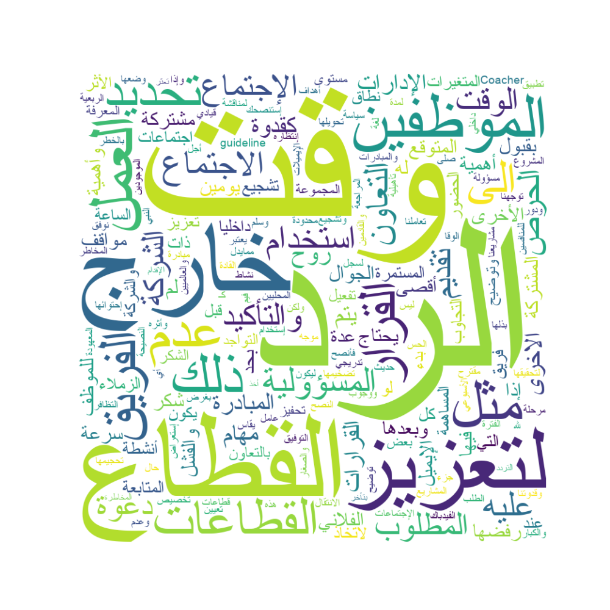
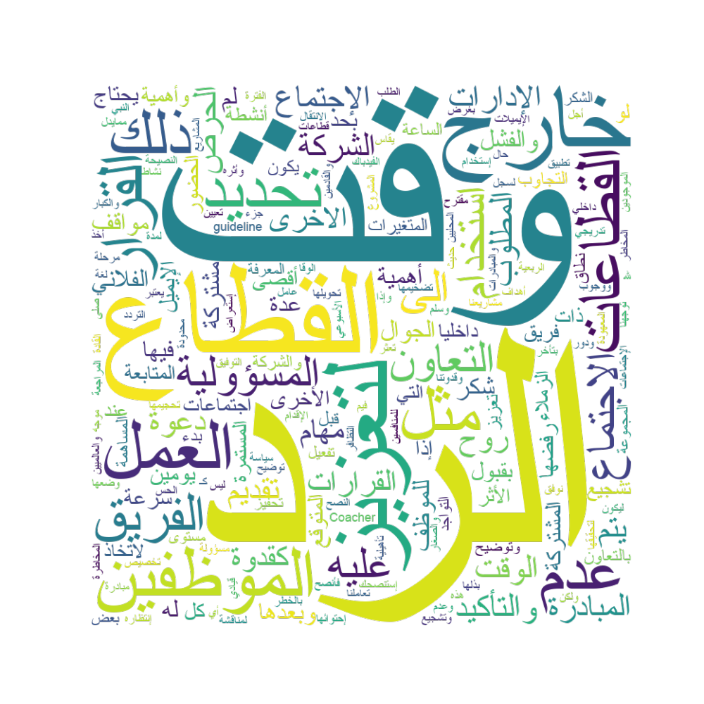

# Arabic Word Cloud Generator

## Overview

This project generates a word cloud image from Arabic text contained in an Excel file. The script reads data from a specified column, processes the text to remove common words, and then creates a visually appealing word cloud using colors inspired by Elm branding. The generated word cloud is saved as a PNG image with a transparent background.

## Features

- **Reads Arabic text**: The script extracts text from a specified column in an Excel file.
- **Customizable colors**: The word cloud uses custom colors based on brand specifications, providing a visually consistent design.
- **Proper Arabic text rendering**: Uses `arabic_reshaper` and `bidi.algorithm` to correctly display Arabic text in the word cloud.
- **Transparent background**: The generated word cloud image has a transparent background for easy integration.

## Requirements

### Python Packages

- **Python 3.x**: The script is compatible with Python 3.x versions.
- **pandas**: For data handling and reading the Excel file.
- **wordcloud**: For generating the word cloud.
- **arabic_reshaper**: For reshaping Arabic text to ensure proper visual representation.
- **bidi.algorithm**: To correct the visual order of Arabic characters.

To install the required packages, run the following command:

```bash
pip install pandas wordcloud arabic-reshaper python-bidi openpyxl
```

### Additional Requirements

- **openpyxl**: Required to read Excel files.
- **DIN Next LT Arabic Regular.ttf**: The font file used to correctly display Arabic characters in the word cloud. Make sure it is placed in the specified path in the script.

## Usage

1. **Install the required packages**: Ensure you have installed all the necessary Python packages using the command provided above.
2. **Update paths**: Modify the script to reflect the correct file paths:
   - **Excel file path**: `'C:/Users/walghamdi/Desktop/Arabiccloude/thesorcefile.xlsx'`.
   - **Font file path**: `'C:/Users/walghamdi/Desktop/Arabiccloude/DIN Next LT Arabic Regular.ttf'`.
   - **Output image path**: `'C:/Users/walghamdi/Desktop/Arabiccloude/arabic_wordcloud.png'`.
3. **Run the script**: Execute the script to generate the word cloud image.

## Notes

- The `words_to_remove` list contains common Arabic words that are filtered out to improve the quality of the word cloud.
- You can modify the colors in the `color_func` function to match your brand or preferred color scheme.

## Troubleshooting

- **Excel file error**: Ensure the file path is correct and that the file exists if you encounter issues while reading the Excel file.
- **Font path error**: If the font path is incorrect or the font file is missing, the script may fail to generate the word cloud.

## Example

Upon successfully running the script, a word cloud image named `arabic_wordcloud.png` will be saved in the specified folder. This image will contain the word cloud based on the processed Arabic text, visualized with the custom color palette.

## Figures

Here are some example images generated by the script:

- 
- 

## License

This project is licensed under the MIT License - see the LICENSE file for details.
